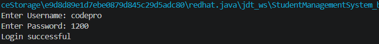
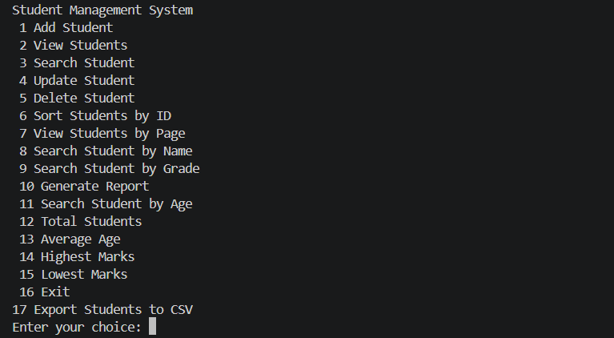
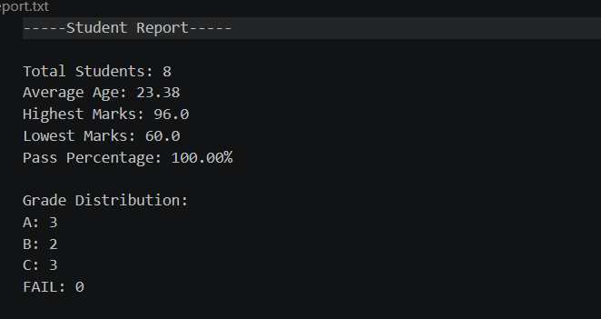

# Student Management System | Java

A console-based Student Management System developed using Java that allows users to manage student records through CRUD operations, authentication, file handling, sorting, and report generation.

## 🚀 Features

- 🔐 User Login Authentication
- ➕ Add Student
- 📋 View Students
- 🔍 Search Student
- ✏️ Update Student
- ❌ Delete Student
- 🔢 Sort Students
- 📁 File Handling
- 📄 Report Export
- 📊 Dashboard Statistics
- 📄 CSV Export

## 🛠 Technologies Used

- Java
- Object-Oriented Programming (OOP)
- Collections Framework
- File Handling
- Exception Handling

## 📚 Concepts Practiced

- Classes and Objects
- Encapsulation
- Collections (ArrayList)
- File Handling
- Exception Handling
- Modular Programming
  
## 📁 Project Structure

```plaintext
Student-Management-System/
│
├── Main.java
├── Student.java
├── StudentService.java
├── FileManager.java
├── LoginService.java
│
├── students.txt
├── report.txt
├── students.csv
│
├── screenshots/
│   ├── login.png
│   ├── menu.png
│   └── report.png
│
└── README.md
```
## 📸 Screenshots

### Login Page



---

### Main Menu



---

### Generated Report



## ▶️ Run Project

Compile:

```bash
javac *.java
```

Run:

```bash
java Main
```

## 🚀 Future Improvements

- Add GUI using Java Swing
- Connect MySQL Database
- Add Spring Boot Backend
- Build Web Version
